# Architecture

This document describes the high-level design of ColimaBar. Read it before you make a large change. For build, test and pull request steps, read [CONTRIBUTING.md](CONTRIBUTING.md). For the user guides, read [docs/](docs/README.md).

## Bird's-eye view

ColimaBar is a menu bar app for [Colima](https://github.com/abiosoft/colima). It does three jobs:

1. **The dashboard.** It shows the VM and its containers, and runs actions on them.
2. **Auto-start.** It runs a proxy on a unix socket, the stable socket. All docker clients use that socket. While the VM is down, the first real docker request starts Colima. Each docker profile also has its own proxy socket, the profile socket, which starts that profile.
3. **Auto-stop.** It can stop the VM of each running profile after an idle time.

ColimaBar is one native process. It uses Swift 6.4, SwiftPM and Apple frameworks only (AppKit, SwiftUI, Observation, UserNotifications, ServiceManagement). It has no third-party dependencies. It runs on Apple silicon with macOS 14 or later.

ColimaBar gets its data from three sources:

- **The Docker Engine API on the unix socket** of the selected profile. For auto-stop and for starts, the model also calls the sockets of the other running profiles. The docker CLI and Portainer use the same transport. `/events` streams changes. `/containers/{id}/stats?stream=1` streams samples for each container, but only while a dashboard is on screen. `docker stats --no-stream` blocks for about 2 seconds on each call, and the stream does not.
- **The `colima` CLI.** Colima has no API. Thus ColimaBar reads VM data from `colima list -j`, and the driver and mount type from `colima status -j`.
- **`scripts/colima-ctl.sh`.** The app bundle contains this script. VM actions, actions that ask for confirmation and changes to `colima.yaml` go through it. Container start, stop and restart calls go directly to the API.

  

## Code map

Sources live in `Sources/ColimaBar/`, in one folder per area. Each file holds one type, or one type and its small private helpers. The file has the name of the type. An extension file has the name `Type+Topic.swift`. Tests in `Tests/ColimaBarTests/` use the same folders.

### `App/`

`AppDelegate` owns the menu bar icon, the popover, the dashboard window, the right-click menu (`showMenu()`) and the debug flags. It also makes sure that only one instance runs. `AppDelegate+Relaunch` restarts the app after an update replaced its bundle. `MainMenu` adds the Edit and Window menus. `Snapshot` renders the debug screenshots.

### `Model/`

`ColimaModel` is the `@Observable` single source of truth for the dashboard, auto-start and auto-stop. It runs the heartbeat, starts the VM of a profile for a proxy (`wakeForProxy(profile:)`), checks for idle time (`checkIdle()` for the selected profile, `checkOtherProfilesIdle()` for the others) and runs the profile actions (`createProfile`, `deleteProfile`, `startProfile`, `stopProfile`).

- `ColimaModel+Rules`: static rules, for example when to hide the icon and how often the heartbeat runs.
- `ColimaModel+Events`: which `/events` messages cause which refresh, and which ones go to `RemovedLogKeeper`.
- `ColimaModel+StartDetection`: finds a `colima start` that already runs, so ColimaBar does not start a second one.
- `ColimaModel+Settings`: reads the user settings for an export, and applies imported settings through the normal setters.
- `SettingsTransfer`: the settings file format (JSON with a format name and a version), its checks and the import plan.
- `DiskShrink`: the rules and the warning text for a smaller disk.
- `VMConfig`: the VM settings in the `colima.yaml` of the selected profile (`ColimaModel.config`), and the values that the settings show (`VMConfig.shown`). For a stopped VM, `colima list` shows the values of the last start, not the file. Memory is a decimal number of GiB, as in Colima: `memory: 2.5` is 2.5 GiB. CPU and disk are whole numbers.
- `AutoStopRule`: the idle rule for one profile, and which other profiles auto-stop checks.
- `ProfileName`: the name rules of `colima-ctl.sh`, and the stricter rules for a new profile.
- `NewProfileForm`: the values and checks of the New Profile form.
- `ProfileDelete`: when a delete is refused, its warning text and the profile to select after it.
- `CtlAction`: the actions of `colima-ctl.sh`.
- `DFGate`: allows one `/system/df` call at a time.
- `LatestOnly`: drops results of overlapping calls that arrive out of order.
- `Models`, `VMState`, `IdleMinutes`: row types, the VM state and the auto-stop times.

### `Docker/`

`DockerAPI` is a small Docker Engine API client over the unix socket. `DockerJSON` holds the JSON wire types.

### `Proxy/`

`SocketProxy` is the auto-start proxy. `SocketProxy+HTTP` parses just enough HTTP to answer pings and to classify requests. `ProfileProxies` owns one `SocketProxy` for each docker profile. `ProfileSocket` derives and checks the path of a profile socket. `UnixSocket` has the socket helpers.

### `System/`

- `Paths`: all file paths. `colimaDir` and `limaDir` find the Colima folder and Lima's folder with the rule in [Actions and `colima-ctl.sh`](#actions-and-colima-ctlsh). The model checks both folders again on each status refresh and each heartbeat tick.
- `Shell`: runs `colima`, `colima-ctl.sh` and other tools, and opens iTerm or Terminal.
- `Routing`: sets and checks the docker routes.
- `ProfileContexts`: creates, updates and removes the `colimabar-PROFILE` docker contexts.
- `LoginItem`: the login item.
- `Notifier` and `AlertThrottle`: notifications and their rate limit.
- `Updater`, `Version`, `ReleaseLink`: the daily release check.
- `Defaults`: `UserDefaults` access.
- `ColimaDirWatcher`: watches the Colima folder, Lima's folder and their subfolders. Lima's folder can be outside the Colima folder (`LIMA_HOME`).
- `FileLimit`: raises the open file limit.

### `Logs/`

The log windows. `LogStore` holds the live state for one container. If the container is gone, it shows the lines that `RemovedLogKeeper` saved. `LogDemuxer` splits the stdout and stderr frames of Docker. `LogLine` is one line with its time, text and stream. `LogTime` parses the Docker timestamps fast, off the main thread. `LogFilter`, `LogBuffer`, `LogTrim` and `LogTail` filter and limit the lines. `LogLimits` holds the limits and timings of a log window. `LogView` and `LogWindows` show the lines. `RemovedLogKeeper` keeps the newest lines of auto-remove containers (`docker run --rm`) while the option is on, and keeps them for 5 minutes after a failure. `RemovedLogRing` is the buffer of one container: the stream thread stores the raw log bytes in it. ColimaBar parses them only when a log window opens.

### `Views/`

The dashboard UI. `Dashboard/` has the frame, header, live tiles, footer and the stopped screen. It also has `ViewState`, the UI state that survives when the popover closes (tab, filter, collapsed groups), and `Sparkline`, the `Shape` that draws the 60-second graphs. `Containers/` and `System/` hold those tabs. `Dashboard/` also has `NewProfileAlert` (the New Profile form) and `DeleteProfileAlert` (the typed confirmation before a profile delete). `System/` also has `VMSettingsSection` (the VM resources and features, on the System tab for a running VM and on the stopped screen for a stopped VM), `SettingsFilePanel` (the export and import panels) and `ShrinkDiskAlert` (the typed confirmation before a disk shrink). `ImagesTab.swift` and `VolumesTab.swift` are the other tabs. `Shared/` has the hover hints (`Hint.swift`), all hint text (`Help.swift`), `TypedNameWatcher` (turns on a destructive button when the typed text matches) and small shared views.

### `Support/`

Small helpers with no app state: `Parse` (for example `colima.yaml` lookup), byte formatting and bounded concurrency. `Logger+ColimaBar` creates loggers in the unified log subsystem `com.imohitkr.ColimaBar`.

### Other files

| Path | Contents |
|---|---|
| `scripts/colima-ctl.sh` | VM actions, confirm dialogs and `colima.yaml` changes. The app bundle contains it. |
| `scripts/install.sh` | The installer. |
| `scripts/uninstall.sh` | The uninstall script. The app bundle contains it. |
| `scripts/make-icon.swift` | Draws `Resources/AppIcon.icns`. |
| `scripts/dmg-readme.txt` | The "Read Me First" file in the disk image. |
| `build.sh` | Builds the app bundle and the disk image. |
| `Makefile` | Shortcuts for build, test, lint and format. |
| `.swift-format` | The `swift format` rules. |
| `Tests/ColimaBarTests/` | Swift Testing tests, in the same folders as the sources. `TestSupport/` has the shared fakes and helpers. |
| `.github/workflows/ci.yml` | CI and the release job. |
| `.github/actions/setup-swift/` | Installs the Swift.org toolchain with swiftly for the macOS CI jobs. |

## Cross-cutting concerns

### Auto-start proxy

All docker clients use the stable socket (`~/.cache/colima-bar/docker.sock`, `Paths.proxySocket`). Its path never changes, and it follows the selected profile. The user guides call it "the ColimaBar socket". This document calls it "the stable socket". "The proxy sockets" means the stable socket and all profile sockets. `Routing` points each client at the stable socket:

  

| Client | Route |
|---|---|
| docker CLI and tools that read contexts | The docker context `colimabar`. ColimaBar switches to it only from `default` or a `colima*` context. |
| IDEs and Dock apps | `launchctl setenv DOCKER_HOST`. ColimaBar also sets `TESTCONTAINERS_DOCKER_SOCKET_OVERRIDE=/var/run/docker.sock` for Ryuk. Both apply to all apps that launchd starts in the session. |
| testcontainers | `docker.host` in `~/.testcontainers.properties`. The write follows a symlink and keeps the file mode. |
| Tools that only try `/var/run/docker.sock` | An optional symlink that needs an admin password (`Routing.linkVarRun()`). |

`Routing.apply()` runs when the app starts and each time the VM starts, because `colima start` switches the docker context back to `colima`. `Routing` never changes a route that points to a different daemon.

The upstream of the stable socket is the Colima socket of the selected profile. While the VM is up, the proxy splices bytes in both directions. While the VM is down, it does this:

  

- It answers `GET` and `HEAD /_ping` itself, so idle pollers do not start the VM. It needs the daemon API version for this answer. `ColimaModel` stores the version from the last real ping in `UserDefaults`. Until the first one, a ping counts as a real request.
- For the first real request, it calls `wakeForProxy()`. Requests that arrive during a wake wait for the same wake.
- `wakeForProxy()` waits for `colima start` to exit. Then it waits for several successful `/images/json` probes in a row. An open socket does not mean that the Docker daemon is ready.
- After the wake, the request continues on the same connection. If the wake fails, the proxy answers HTTP 503 with a JSON `message`.
- `wakeForProxy()` does not start a deleted non-default profile, or a profile with a runtime other than docker.

On quit, or when auto-start is off, `SocketProxy.stop()` replaces the path with a symlink to the Colima socket. It creates the link before it closes the listener, so a client never sees a missing socket.

The listener is a GCD read source on a non-blocking fd. When a client waits, the event handler accepts all waiting clients and starts one thread for each connection. There is no accept thread for each proxy. Only the cancel handler of the source closes the fd. GCD runs it after the last event handler returns. Thus the system cannot give the same fd number to a new listener while an accept can still run on the old one.

### Profile sockets

`ProfileProxies` runs one more `SocketProxy` for each profile with the docker runtime in the last `colima list`. The socket is `~/.cache/colima-bar/profiles/PROFILE.sock` (`Paths.profileSocket`). Its upstream is the Colima socket of that profile. It changes only when the Colima folder moves (`ProfileProxies.refreshUpstreams()`). A real request to it calls `wakeForProxy(profile:)` for that profile only. The readiness gate and the refusals are the same as for the stable socket.

- `ProfileSocket.path` returns nil for an invalid name, or when the path is longer than 99 bytes: sun_path holds 103 bytes, and `UnixSocket.listen` binds at `PATH.tmp` first. ColimaBar logs the skipped name once.
- `refreshStatus()` calls `syncProfiles()` after each `colima list`. It creates the proxies of new profiles, removes the proxies of gone profiles and deletes old files in the folder. It keeps the proxy of a profile while its busy marker exists, because a disk shrink deletes the profile for a short time. An empty list changes nothing. A debug run changes nothing.
- `ProfileContexts` keeps one docker context `colimabar-PROFILE` for each proxy. It changes only contexts whose description starts with "ColimaBar". It runs the docker CLI only when the wanted set changes. The `colimabar` context, the launchd `DOCKER_HOST` and the testcontainers route still point at the stable socket.
- `wakeForProxy(profile:)` runs one wake at a time for each profile. The stable socket and the profile socket of the selected profile can ask for the same wake.
- `colima start` of any profile switches the docker context to that profile. When `refreshStatus()` sees a different profile start, it runs `Routing.apply()`.
- Each proxy holds one listening fd and one GCD read source. It has no accept thread. Thus the idle cost grows by one fd for each profile.

On quit, or when auto-start is off, each profile socket becomes a symlink to the Colima socket of its profile.

### VM state

The heartbeat runs each second while a dashboard is open or an action runs. Otherwise it runs each 5 seconds. It pings the Docker socket each 3 seconds while a dashboard is open, and each 10 seconds otherwise.

ColimaBar runs `colima list -j` only in these cases:

- A ping shows that the VM went up or down.
- `ColimaDirWatcher` sees a change in the Colima folder (`Paths.colimaDir`), a profile folder, Lima's folder (`Paths.limaDir`) or a Lima instance folder.
- The dashboard opens and the last list is more than 1 minute old.
- The last list is more than 5 minutes old (1 minute when the state is not running or stopped).

The model reads the `colima.yaml` of the selected profile after each `colima list`, each time the dashboard opens, and after a config edit of a stopped VM.

### Actions and `colima-ctl.sh`

ColimaBar sends the profile in `COLIMABAR_PROFILE`: the selected profile, or the profile of a profile menu action. The script takes a lock for each profile and writes a busy marker while a VM action runs. Its stderr goes to `~/.cache/colima-bar/ctl.log`. Each VM dialog of the script names the profile, for example "Grow the Colima disk of profile 'work' to 150 GB?".

`with_busy` runs the action in an extra subshell, `( "$@" ) &`. Without it, bash 3.2 (the `/bin/bash` of macOS) can run the first `command colima` of the action with `exec`. Then the action ends after that call. For example, `restart_vm` stops the VM but does not start it again. A test with stub tools (`ColimaCtlScriptTests`) checks this.

`profile-create CPU MEM DISK [RUNTIME]` runs `colima start` with these values for a new profile. It checks the name with the same rules as `ProfileName.problem`. `profile-delete` refuses the name `colima` and names that start with `colima-`, because Colima reads them as a different profile: it maps `colima` to `default` and removes the `colima-` prefix. It also refuses a profile without a folder. Then it asks once more and runs `colima delete --data --force`. The app shows a typed confirmation before it.

ColimaBar (`Paths.colimaDir`), the script and `uninstall.sh` find the Colima folder with the same rule as Colima. They use the first match:

1. `COLIMA_HOME`, if it is set and the folder exists.
2. `~/.colima`, if it exists.
3. `~/.config/colima`, if it exists.
4. `$XDG_CONFIG_HOME/colima`, if `XDG_CONFIG_HOME` is set.
5. `~/.colima`, the default of Colima.

Lima's folder (`Paths.limaDir`) is `LIMA_HOME` if it is set, else `_lima` in the Colima folder. ColimaBar runs each `colima` command, `colima-ctl.sh` and each Terminal command with `COLIMA_HOME` set to the Colima folder, so Colima uses the same folder. It creates the folder first, because Colima skips a `COLIMA_HOME` that does not exist. Before it creates the folder, the app and `colima-ctl.sh` check the rules again. They create the folder only if the rules still pick it and colima is installed. If the rules now pick a different folder, the script stops the action. A new empty `~/.colima` would otherwise hide `~/.config/colima` from then on. The app reads `COLIMA_HOME`, `LIMA_HOME` and `XDG_CONFIG_HOME` from its launchd environment, not from the shell. The model checks the folders again on each status refresh and each heartbeat tick, so a change needs no restart.

The name checks of the script list each allowed character, not a range such as `[a-z]`. Thus they match only ASCII in every locale.

`resources`, `rosetta`, `k8s` and `disk` restart a running VM after a dialog. For a stopped VM, they only change `colima.yaml`, and the values apply at the next start (`CtlAction.editsConfigWhenStopped`). They write no busy marker then, so the app shows "Saving" until the script ends. `resources`, `rosetta` and `k8s` show no dialog for a stopped VM. `disk` still asks, because the grow becomes permanent at the next start. If the VM starts or stops while that dialog is open, the script changes nothing and exits with 1. `k8s on` for a stopped VM does not switch the kubectl context. `colima start` switches to it.

`resources CPU MEM` takes a whole number of CPUs and a whole or decimal number of GiB for memory, such as 2.5. Both must be 1 or more. The memory picker of the app shows a value that is not a preset, such as 2.5 GB, as an extra choice. Thus a change of the CPU only sends the same memory again (`ByteFormat.gibText`). A value below 1 GB starts the pick at 1 GB, because the script refuses less. Colima gives Lima the memory in whole MiB, so `ByteFormat.gib(bytes:)` rounds to 2 decimals. While the VM runs, the settings show the value of `colima.yaml` if it is within 1 MiB of the live value (`VMConfig.shown`).

`run()` sends the VM state that it used for `showsDialog(running:)` in `COLIMABAR_EXPECT_RUNNING` (1 or 0), for each action whose dialog depends on the state (`CtlAction.checksExpectedState`: `resources`, `rosetta` and `k8s`). If the VM is in the other state, for example because it started outside the app, the script changes nothing and exits with 1 (`vm_state`). Thus no dialog opens behind the popover. After a config edit of a stopped VM, `execute` reads `colima.yaml` again before "Saving" ends.

While a `colima start` or `colima restart` for the profile runs (`start_in_progress`), the script refuses `disk`, `disk-shrink`, and `resources`, `rosetta` and `k8s`, before any dialog. It exits with 1. A restart would run a second `colima start` during it, and a shrink would delete the VM while it starts. During a start, `colima status` still fails. Thus while a dialog is open, a start that begins counts as a running VM (`same_state`).

`start_in_progress` uses the same rule as `ColimaModel.isStartInProgress`. The profile is the value of `--profile` or `-p` (also `--profile=NAME` and `-p=NAME`). Else it is the first word after `start` or `restart` that is not a flag and not the value of a flag, such as the `4` of `--cpu 4` (`ColimaModel.startValueFlags`). Else it is `default`. Colima reads `colima` as `default` and removes a `colima-` prefix. `colima start -f` does not count: it is a foreground supervisor. For `colima restart`, `-f` means `--force`, and it counts.

The script reads values of `colima.yaml` in the same forms as `VMConfig.parse`: with CRLF line ends, inline comments and quotes. The script runs `colima status` in a subshell. If the Colima folder changed, the main shell exits after the subshell, without the redirect, so the notice of `cleanup` reaches the app.

A disk cannot shrink in place. `disk-shrink N` saves a copy of `colima.yaml` with `disk: N`, then runs `colima stop`, `colima delete --data --force`, puts the copy back and runs `colima start`. `colima delete` removes the profile folder with `colima.yaml`, so the copy keeps the other VM settings. Colima creates the new disk only at a start. Thus for a stopped VM, the script runs `colima stop` at the end. The busy marker covers the full run. That start switches the docker context. The VM runs only for a short time, so a refresh can miss it. Thus after each shrink that was not cancelled, the model runs `Routing.apply()`. While the busy marker exists, the model does not switch away from a profile that `colima list` no longer shows, and auto-start waits.

The exit codes are fixed. 0 means done. 1 means failed, and the script already notified the user. 2 means cancelled, or another VM action holds the lock. ColimaBar shows nothing for 2.

### Auto-stop

`AutoStopRule.evaluate` holds the idle rule for one profile. A profile is idle when no container runs, no `colima-ctl.sh` action that ColimaBar started runs (`blocksAutoStop`) and its proxies have no active transfers. A transfer is a connection whose latest request is a build, pull, push, load, save, commit or BuildKit session (`SocketProxy.isWork`). Each profile has its own idle time. The timeout setting is the same for all.

- `checkIdle()` checks the selected profile at each tick. It counts the transfers of the stable socket and of the profile socket of the selected profile. Before it stops the VM, it gets a fresh container list. If that fails, it does not stop.
- `checkOtherProfilesIdle()` checks each other running docker profile (`AutoStopRule.otherProfiles`). A transfer or a busy marker resets its idle time at each tick. Each 30 seconds (`AutoStopRule.otherCheckInterval`), it gets a fresh container list from the socket of the profile. A failed list does not count as idle. When the idle time is over, it runs `auto-stop` for that profile.

### Login item

The login item is a plain LaunchAgent plist with the label `com.imohitkr.ColimaBar.login` in `~/Library/LaunchAgents`. It has `KeepAlive` for a failed exit, so launchd restarts ColimaBar after a crash. A normal quit is respected.

ColimaBar does not use `SMAppService`. launchd ties an `SMAppService` agent to the code signature, and each ad-hoc build has a new signature. `LoginItem.migrate()` removes the old agent one time.

### Notifications

Notifications go out for failures: a container exits with an error, gets OOM-killed or becomes unhealthy, or an action fails. Exit codes 0, 130, 137 and 143 are a normal stop (`ColimaModel.ignoredExitCodes`). Containers with the label `org.testcontainers=true` do not send alerts. Two other notifications go out once: one for each new version, and one the first time the icon hides. `AlertThrottle` allows one banner for each container and alert kind each 10 minutes. The dashboard keeps a list of recent alerts, so nothing is lost when notifications are off.

**Saved logs.** Docker removes an auto-remove container (`docker run --rm`) and its logs right after it dies. While the option is on (`Defaults.Key.keepRemovedLogs`, off by default) and crash alerts are on, `RemovedLogKeeper` does this for the selected profile:

1. On a `start` event, it inspects the container. If `HostConfig.AutoRemove` is true, it opens one log stream (`follow=1`, `tail=100`).
2. The stream thread stores the raw log bytes in a `RemovedLogRing`, at most 500 lines and 128 KB for each container. Nothing parses them yet. The main actor does no work for each line.
3. On `die` with a crash exit code (`ColimaModel.isCrashExit`, the same rule as the alert) or after `oom`, it keeps the lines for 5 minutes. A clean exit, or a `destroy` without a failure, drops them. It closes the stream at most 2 seconds after `die`.
4. "View logs" calls `ColimaModel.openLogs`. `LogStore` inspects the container. If the daemon answers 404, ColimaBar parses the saved bytes, and the window shows the lines with the status "Saved from a removed container" and does not reconnect. Otherwise it shows live logs.

The buffers are not observed. The model publishes only `savedLogIDs`, the set of kept containers, for the alerts list. A profile switch, or turning the option off, drops all buffers.

### Update check

`Updater` asks the GitHub releases API one time each day. It builds the release link from the tag and accepts only release pages of this repository.

### Performance and limits

When the dashboard is closed, the app idles at about 0% CPU. These limits keep memory and file use low:

| Limit | Value | Where |
|---|---|---|
| Open file limit | 8192 (launchd starts apps with 256) | `FileLimit`, login item plist |
| Lines in a log window | 20,000 lines and 32 MB of text | `LogLimits` |
| Rendered log lines | the newest 2,000; copy and filter use all lines | `LogTail` |
| Saved logs of removed containers | 500 lines and 128 KB of raw log data for each container, 50 containers (about 6.4 MB), 5 minutes after a failure | `RemovedLogKeeper` |
| Proxy request head | 64 KB, then HTTP 431 | `SocketProxy.maxHead` |
| Proxy copy buffer | 16 KB for each direction | `SocketProxy.bufferSize` |
| Idle client while the VM is down | closed after 5 minutes | `SocketProxy.idleTimeout` |
| `ctl.log` | starts again after 1 MB | `Shell` |

Live stats stream only while a dashboard is on screen. Saved-log streams open only while the option is on, one for each running auto-remove container. `/system/df` runs only for the tabs that show it. Graphs use SwiftUI `Shape`, not Swift Charts, because Swift Charts uses a lot of graphics memory.

### Debug runs

`--snapshot`, `--popover` and `--notify-test` start a debug run. A debug run does not change the proxy sockets, the docker routes and contexts or the login item. Thus it can run next to the installed app. [CONTRIBUTING.md](CONTRIBUTING.md#debug-flags) lists the flags.

## Invariants

Do not break these rules.

- **Fixed popover size.** The popover is 480 x 640 points (`AppDelegate.popoverSize`). In `ColimaModel`, assign a property only when its value changes. Otherwise the popover jitters and SwiftUI redraws too much.
- **No dialog behind the popover.** Call `model.dismissPopover()` before an alert or a file panel opens from the popover. A `colima-ctl.sh` action that asks with a dialog has `CtlAction.showsDialog(running:)`, and `run()` closes the popover for it. Some actions ask only while the VM runs. A test checks the list for a running VM against the script.
- **Proxy sockets.** The stable socket is `~/.cache/colima-bar/docker.sock` (`Paths.proxySocket`). The profile sockets are `~/.cache/colima-bar/profiles/PROFILE.sock` (`Paths.profileSocket`). Each socket has mode `0600`. Their folders have mode `0700`. Do not change the paths or relax the modes.
- **Quit behavior.** On quit, or when auto-start is off, the stable socket path becomes a symlink to the Colima socket of the selected profile, and each profile socket path a symlink to the Colima socket of its profile (`SocketProxy.stop()`). Docker clients must keep working without ColimaBar.
- **Docker contexts.** ColimaBar creates, updates and removes only the `colimabar` context and the `colimabar-PROFILE` contexts whose description starts with "ColimaBar". It never changes other contexts.
- **`colima-ctl.sh`.** The app bundle contains it in `Contents/Resources`. Exit code 0 means done. Exit code 1 means failed (the script already notified the user). Exit code 2 means cancelled, or another VM action holds the lock. ColimaBar shows nothing for 2.
- **Login item.** It is a plain LaunchAgent plist with the label `com.imohitkr.ColimaBar.login` in `~/Library/LaunchAgents`. Do not use `SMAppService`. launchd ties an `SMAppService` agent to the code signature, and each ad-hoc build has a new signature. `LoginItem.migrate()` removes the old `SMAppService` agent.
- **Log `since`.** The Docker logs `since` parameter must be UNIX seconds with nine digits of nanoseconds (`sec.nanos`). See `LogStore.sinceParam`.
- **Readiness gate after a wake.** An open socket does not mean that the Docker daemon is ready. `wakeForProxy()` waits for `colima start` to exit, then for several successful `/images/json` probes in a row. During a wake of profile P, every proxy whose upstream is P holds its requests until the shared wake ends (`SocketProxy.holdForWake`, set by `syncWakeHolds()`). These are the stable socket when P is selected, and the profile socket of P. While a wake runs, `connectIfAwake()` returns `.down`, so no request is spliced before the gate passes.
- **Debug runs.** `--snapshot`, `--popover` and `--notify-test` set `AppDelegate.isDebugRun`. A debug run must not change the proxy sockets, the docker routes and contexts or the login item.

## Testing

Tests use Swift Testing. Logic lives in small static functions, so tests can call it without a VM. `Tests/ColimaBarTests/TestSupport/` has shared fakes, for example `FakeDaemon`. Automated runs never start or stop the user's Colima VM.

`Tests/ColimaBarTests/Scripts/` tests the scripts in `scripts/`. `ScriptSandbox` runs a copy of a script in a temporary HOME, with stub `osascript`, `colima`, `docker`, `kubectl` and `pgrep` first on its PATH. Thus no dialog reaches the screen, and no VM or docker context changes. The uninstall tests source only the helper functions of `uninstall.sh`.
