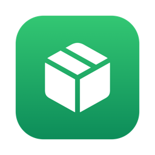
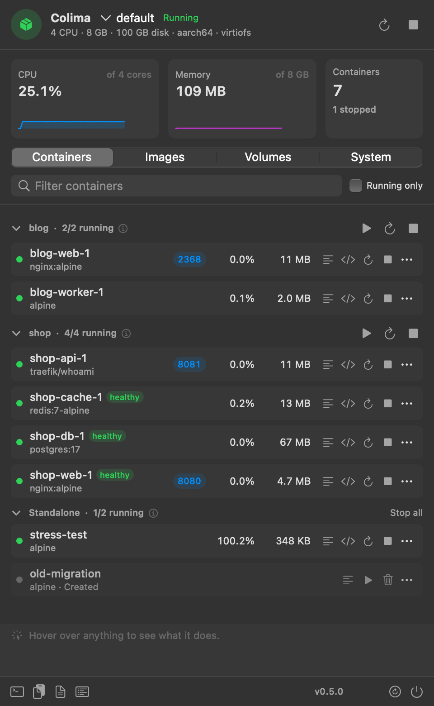
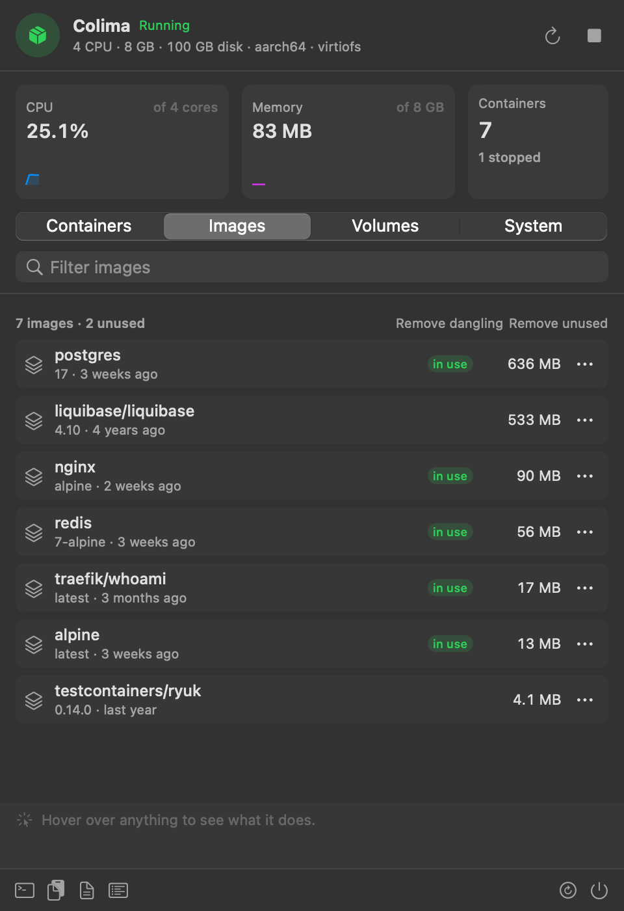
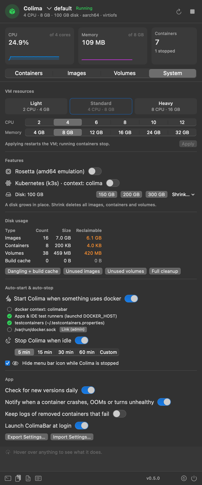
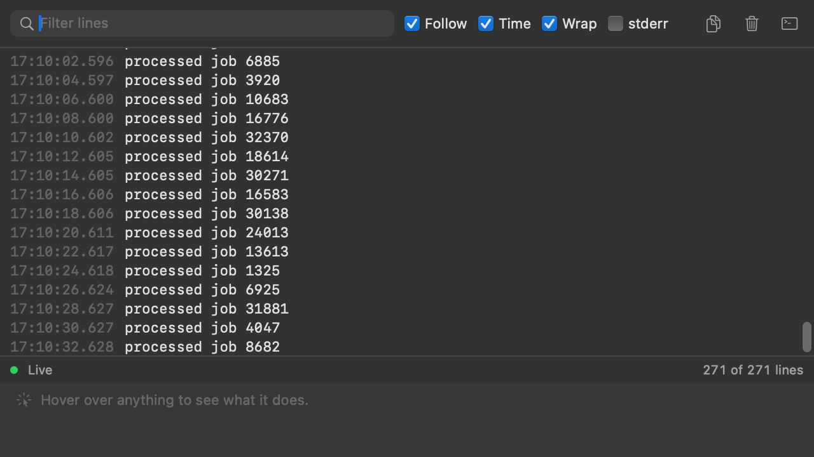

<p align="center">
  
</p>

<h1 align="center">ColimaBar</h1>

<p align="center">
  A native macOS menu bar dashboard for <a href="https://github.com/abiosoft/colima">Colima</a> that <b>starts the VM on demand</b>.<br>
  Run <code>docker</code>, a test suite or an IDE test while Colima is stopped. ColimaBar starts the VM, and the command continues.
</p>

<p align="center">
  <a href="https://github.com/imohitkr/colima-bar/actions/workflows/ci.yml"></a>
  
  
  
  <a href="LICENSE"></a>
</p>

<p align="center">
  
</p>

ColimaBar shows the state of your Colima VM and its containers in the menu bar.

- **Auto-start**: all docker clients (terminal, IDE, testcontainers) use one socket. The first real request on that socket starts Colima. A cold `docker run` takes about 15 s.
- **Live dashboard**: one dashboard shows containers grouped by Compose project, health, ports, CPU and memory per container, logs, images, volumes and VM settings.
- **Quiet**: ColimaBar idles at about 0% CPU. It can stop the VM when it is idle. It sends a notification only when something fails.

## Screenshots

<table>
  <tr>
    <td width="50%"></td>
    <td width="50%"></td>
  </tr>
  <tr>
    <td align="center"><b>Images</b>: sizes, images in use, one-click prune</td>
    <td align="center"><b>System</b>: VM presets, Rosetta, k3s, disk, auto-start, auto-stop and app settings</td>
  </tr>
  <tr>
    <td colspan="2"></td>
  </tr>
  <tr>
    <td colspan="2" align="center"><b>Log viewer</b>: live follow, search, timestamps, highlighted stderr. The log viewer stays open when the container restarts.</td>
  </tr>
</table>

## Install

### Requirements

- A Mac with Apple silicon
- macOS 14 or later
- [Colima](https://github.com/abiosoft/colima). To install it, run `brew install colima docker`.

### The installer (recommended)

Run this command in Terminal:

```sh
curl -fsSL https://raw.githubusercontent.com/imohitkr/colima-bar/main/scripts/install.sh | bash
```

The installer downloads the latest release and installs ColimaBar in `/Applications`. If it cannot write to `/Applications`, it uses `~/Applications`. Then it opens ColimaBar. macOS does not show the "Apple could not verify" prompt for this download.

### The disk image

1. Download [ColimaBar.dmg](https://github.com/imohitkr/colima-bar/releases/latest/download/ColimaBar.dmg).
2. Open the disk image.
3. Drag ColimaBar into Applications.

Apple does not notarize ColimaBar. Thus the first launch shows "Apple could not verify ColimaBar". Do these steps one time:

1. Click **Done**.
2. Open **System Settings > Privacy & Security**.
3. Next to "ColimaBar was blocked", click **Open Anyway**.
4. Enter your password, then click **Open Anyway** again.

As an alternative, remove the quarantine flag in Terminal, then open ColimaBar:

```sh
xattr -dr com.apple.quarantine /Applications/ColimaBar.app
```

The release also contains [ColimaBar.zip](https://github.com/imohitkr/colima-bar/releases/latest/download/ColimaBar.zip). The installer uses this file.

### From source

You need the Xcode Command Line Tools.

```sh
git clone https://github.com/imohitkr/colima-bar && cd colima-bar
./build.sh install    # builds, installs to ~/Applications and launches
./build.sh dmg        # builds build/ColimaBar-<version>.dmg
```

### After you install

Add the [`DOCKER_HOST` snippet](#auto-start) to your `~/.zshrc`.

When you open ColimaBar from an Applications folder for the first time, it turns on the login item. ColimaBar then starts when you log in.

## Update

ColimaBar checks GitHub for a new release one time each day. When a new version is available, ColimaBar does two things:

- It sends one notification for that version.
- It shows an **Update** button in the dashboard footer. The button opens the release page.

To update, run [the installer](#the-installer-recommended) again. The installer quits ColimaBar, replaces the app in the same folder and opens it again.

If you use the disk image, download it again and replace the app in Applications.

To turn off the daily check, clear **Check for new versions daily** on the System tab.

## Use

Left-click the menu bar icon to open the dashboard. Move the pointer over a control to see what it does.

Right-click the menu bar icon for these menu items:

- **Start Colima**, or **Restart Colima** and **Stop Colima** when the VM runs
- **Open Dashboard Window**
- **Launch at Login**
- **Auto-start Colima on Demand**
- **Hide Icon While Colima Is Stopped**
- **Check for Updates…** (or **Download ColimaBar *version*…** when an update is available)
- **Quit ColimaBar**

The dashboard footer shows the ColimaBar version. Click it to check for a new version.

Keyboard shortcuts in the dashboard: ⌘R refreshes the data. ⌘F moves the focus to the filter field.

## Features

- **Auto-start**: all docker clients use the socket of ColimaBar. That socket starts Colima when a real request arrives. See [Auto-start](#auto-start).
- **Auto-stop** (off by default): ColimaBar stops the VM when it is idle. See [Auto-stop](#auto-stop).
- **Hide the icon** (off by default): the icon leaves the menu bar while Colima is stopped. See [Hide the icon](#hide-the-icon).
- **Live usage**: the total CPU and memory of all containers, as a share of the VM, with 60-second graphs.
- **Containers**:
  - ColimaBar groups containers by Compose project. You can start, stop or restart a full project.
  - Each container shows health badges, CPU, memory and `localhost` links for its ports.
  - Each container has restart, stop, start, remove and shell actions.
  - You can filter the list and show running containers only.
- **Log viewer**: each container gets a live log window. It has search, follow, timestamps, a stderr filter and copy. The window stays open when the container restarts. You can also follow the logs in iTerm (or Terminal, if iTerm is not installed).
- **Images** and **Volumes**: sizes, used and unused items, pull, remove and prune.
- **VM settings**: CPU and memory presets, Rosetta, Kubernetes (k3s), disk growth and SSH. You can also open `colima.yaml` and the Colima log.
- **Alerts for failures only**: ColimaBar sends a notification in these cases:
  - A container exits with an error code, gets OOM-killed or becomes unhealthy. The notification has **View logs** and **Restart** buttons. ColimaBar ignores testcontainers containers.
  - An action fails.

  ColimaBar sends no notification for a normal start or stop.
- **Profiles**: if you have more than one Colima profile, a profile picker appears. With one profile, the picker stays hidden.
- **The login item**: ColimaBar starts when you log in. If it crashes, it starts again immediately. Only one copy runs at a time.

## Auto-start

### How docker clients reach Colima

All docker clients use one stable socket path: `~/.cache/colima-bar/docker.sock`. When ColimaBar starts, it sets these routes to that path:

| Client | Route |
|---|---|
| Terminal `docker`, scripts | `DOCKER_HOST` in `~/.zshrc` (falls back to the Colima socket if the path is missing) |
| IDE test runners and apps that you open from the Dock | `launchctl setenv DOCKER_HOST` |
| Tools that read docker contexts | context `colimabar` |
| testcontainers (Java, Go) | `docker.host` in `~/.testcontainers.properties` |
| Tools that only try `/var/run/docker.sock` | optional symlink. To create it, click **Link (admin)** on the System tab. |

ColimaBar does not change a route that points to a different daemon, for example a remote docker context.

### What the proxy does

While ColimaBar runs, the stable socket is a proxy:

- If the VM is up, the proxy copies all bytes to and from the Colima socket. Thus attach, exec, builds and log streams work.
- If the VM is down, the proxy answers the docker `/_ping` preflight itself. Thus idle pollers do not start the VM. The first real request starts Colima and then continues on the same connection.

### When ColimaBar quits

When ColimaBar quits, the stable socket becomes a **symlink to the Colima socket**. All clients continue to work, but auto-start stops. Colima and your containers continue to run. You do not need to change the routes back. When ColimaBar starts again, auto-start starts again.

If you turn off auto-start, the stable socket also becomes a symlink to the Colima socket.

### Shell setup

Add this snippet to your `~/.zshrc`:

```sh
if [ -e "$HOME/.cache/colima-bar/docker.sock" ]; then
  export DOCKER_HOST="unix://$HOME/.cache/colima-bar/docker.sock"
else
  export DOCKER_HOST="unix://$HOME/.config/colima/default/docker.sock"
fi
```

Restart any IDE that was open when ColimaBar ran for the first time. The IDE reads the launchd `DOCKER_HOST` only when it starts.

## Auto-stop

Auto-stop is off by default. To turn it on, select **Stop Colima when idle** on the System tab.

ColimaBar stops the VM after it is idle for the time that you select: 5, 15, 30 or 60 minutes. You can also type a custom time from 1 to 1440 minutes.

The VM is idle when it has no running containers and no docker builds, pulls or pushes. Before ColimaBar stops the VM, it gets a new container list to confirm this.

If auto-start is on, the next docker command starts the VM again.

## Hide the icon

This option is off by default. To turn it on, select **Hide menu bar icon while Colima is stopped** on the System tab or in the right-click menu.

When Colima is stopped, the icon leaves the menu bar. ColimaBar continues to run. If auto-start is on, a docker command still starts Colima. When Colima starts, the icon comes back.

The icon stays visible while an action runs or while the VM of a different profile runs.

To show the icon while Colima is stopped, open ColimaBar from Spotlight. The icon and the dashboard appear. When you close the dashboard, the icon hides again.

## How it works

- ColimaBar gets container data from the **Docker Engine API on the unix socket**. Portainer and the docker CLI use the same transport.
  - `/events` streams changes.
  - `/containers/{id}/stats?stream=1` sends samples for each container, but only while the dashboard is open. `docker stats --no-stream` blocks for about 2 s on each call. The stream does not.
- Colima has no API. Thus ColimaBar gets VM data from `colima list -j` and `colima status -j`. These commands run when a socket `/_ping` shows that the VM went up or down. Otherwise they run one time each minute.
- VM actions, actions that ask for confirmation and changes to `colima.yaml` go through `colima-ctl.sh`. The app contains this script (`scripts/colima-ctl.sh` in the repository). ColimaBar sends the selected profile in `COLIMABAR_PROFILE`.
- Container start, stop and restart calls go directly to the API.
- When the dashboard is closed, the app idles at about 0% CPU.

## Uninstall

Run the uninstall script that is in the app:

```sh
/Applications/ColimaBar.app/Contents/Resources/uninstall.sh
```

If you installed ColimaBar in `~/Applications`, use this path:

```sh
~/Applications/ColimaBar.app/Contents/Resources/uninstall.sh
```

From a clone of the repository, run `scripts/uninstall.sh`. It does the same thing.

The script does these steps:

- It quits ColimaBar and removes the login item.
- It switches the docker context back to `colima` and removes the `colimabar` context.
- It clears the launchd `DOCKER_HOST` and the testcontainers `docker.host`.
- It removes the `/var/run/docker.sock` symlink if ColimaBar created it. This step asks for your password.
- It deletes the app, the ColimaBar cache and the ColimaBar settings.
- It makes the stable socket path a symlink to the Colima socket. Thus a `DOCKER_HOST` in your `~/.zshrc` continues to work.

## Roadmap

- kubectl context and namespace switcher
- Global hotkey
- Docker context switcher for remote daemons

## License

[MIT](LICENSE)
